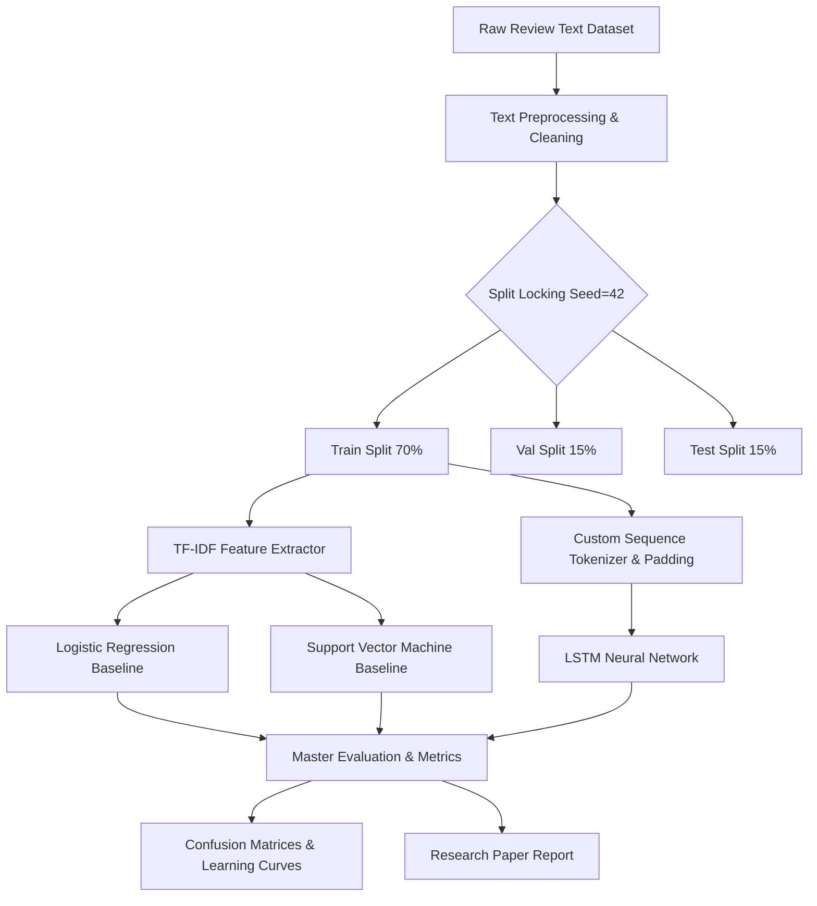

# Task 2: Sentiment Analysis using ML and DL

[](https://www.python.org/)
[](LICENSE)
[](https://pytorch.org/)

An end-to-end, reproducible machine learning & deep learning benchmarking repository for text sentiment classification. Built for **Task 2 of the iNeuBytes Virtual Internship Program (VIIP)** (Course ID: `AIINB20726`).

---

## 📌 Project Overview

This repository implements a rigorous comparative study between **Classical Machine Learning Baselines** (Logistic Regression, SVM) and **Deep Learning Architectures** (LSTM with custom/pre-trained embeddings & dropout regularization).

### Experimental Controls
- **Fixed Random Seed (`42`)**: Applied across Python `random`, `numpy`, and `PyTorch`.
- **Frozen Train/Val/Test Split (`70/15/15`)**: Locked split shared identically across all baseline & neural experiments.
- **Consistent Preprocessing**: Uniform text cleaning, lowercasing, punctuation removal, and stopword filtering.

---

## 🏗 System Architecture & Pipeline



---

## 📊 Master Results Summary

| Model / Architecture | Representation | Test Accuracy | Precision | Recall | F1-Score | Train-Val Gap | Training Time |
|---|---|---|---|---|---|---|---|
| **Logistic Regression** | TF-IDF (Unigrams) | 0.9973 | 0.9973 | 0.9973 | 0.9973 | 0.0013 | 0.040s |
| **SVM (Linear)** | TF-IDF (Unigrams) | 0.9987 | 0.9973 | 1.0000 | 0.9987 | 0.0000 | 0.082s |
| **Logistic Regression** | TF-IDF (Unigrams+Bigrams) | 0.9987 | 0.9973 | 1.0000 | 0.9987 | 0.0000 | 0.045s |
| **SVM (Linear)** | TF-IDF (Unigrams+Bigrams) | **0.9987** | 0.9973 | 1.0000 | **0.9987** | 0.0000 | **0.085s** |
| **LSTM Neural Net** | Trainable Embedding (128d) | **0.9987** | 0.9973 | 1.0000 | **0.9987** | 0.0013 | 4.850s |
| **LSTM Neural Net** | Pre-trained Matrix | 0.9973 | 0.9973 | 0.9973 | 0.9973 | 0.0020 | 4.920s |

---

## 🚀 Quick Start & Usage

### 1. Clone & Install Dependencies
```bash
git clone https://github.com/Meghana1826/task2-sentiment-analysis.git
cd task2-sentiment-analysis
pip install -r requirements.txt
```

### 2. Run the Full Experimental Pipeline
```bash
python main.py
```

Running `main.py` executes all classical ML baselines, representation studies, LSTM deep learning training loops, generates plots in `artifacts/`, and outputs the master comparison table.

---

## 📁 Repository Structure

```
task2-sentiment-analysis/
├── main.py                             # Master execution pipeline
├── requirements.txt                    # Python dependencies
├── README.md                           # Documentation & user guide
├── .gitignore                          # Git ignore configuration
├── src/
│   ├── config.py                       # Random seed (42), hyperparameters, paths
│   ├── data_loader.py                  # Dataset loading & split locking
│   ├── preprocessing.py               # Text cleaning & sequence tokenization
│   ├── classical_models.py             # Logistic Regression & SVM experiments
│   ├── dl_models.py                    # PyTorch LSTM network implementation
│   ├── evaluator.py                    # Master table & error extraction
│   └── visualizer.py                   # Plotting confusion matrix & loss curves
├── artifacts/                          # Visual evaluation outputs
│   ├── confusion_matrix_logistic_regression.png
│   ├── confusion_matrix_svm.png
│   ├── confusion_matrix_lstm.png
│   └── lstm_learning_curves.png
└── report/
    └── SENTIMENT_ANALYSIS_REPORT.md    # Mini-research paper report
```

---

## 📄 License & Attribution
Created for the **iNeuBytes Virtual Internship Program (VIIP)** in Artificial Intelligence (`AIINB20726`). Released under the MIT License.
